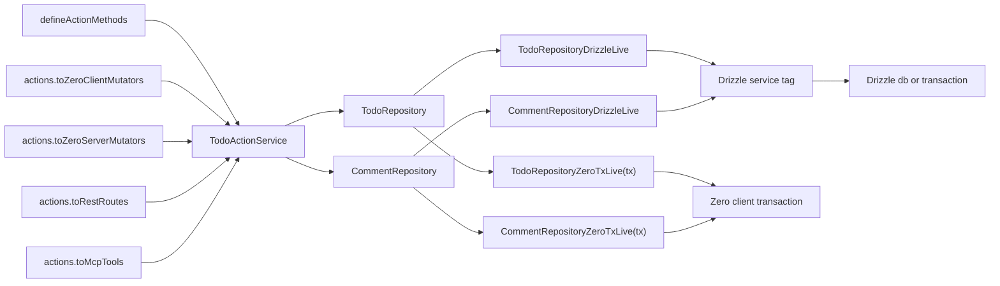

# Reusable Effect DB Service Layer Research

## High-Level Goal

Design a reusable Effect v4 beta pattern that lets application code write realistic domain services and repositories with the Valterra-style `Context.Service(..., { make })` pattern.

Drizzle-specific persistence code can depend directly on a `Drizzle` tag:

```ts
const db = yield * Drizzle;
```

Cross-runtime actions should depend on action services, domain services, or repositories:

```ts
const todos = yield * TodoRepository;
const actions = yield * TodoActionService;
```

The same workflow should run in both places:

- Zero client-side mutators, backed by Zero's optimistic `tx`.
- Server/API code, backed by normal Drizzle or Drizzle's Effect Postgres driver.

The reusable part should be the layer/factory pattern. App-specific services can still define domain operations, but the runtime wiring should not be rewritten for each app.

## Scope

This research is only for Effect v4 / Effect beta.

Out of scope:

- Effect v3 API compatibility.
- `Effect.Service` and `.Default` patterns used by older v3 examples in this repository.
- Maintaining dual v3/v4 service authoring docs.

The v4/beta source currently points to `Context.Service` as the service tag/class API.

## Current Assumptions

- The shared business workflow should not import server-only DB code.
- The shared business workflow should not branch on `tx.location`.
- The browser bundle must not import Drizzle, Postgres, `pg`, or server schema modules.
- Zero client `tx` and Drizzle do not expose identical APIs, so a raw "same DB object everywhere" is probably not viable.
- A small common repository/service contract is safer than exposing all of Drizzle through browser-safe code.
- Hard cutover is acceptable; no backward compatibility layer is required.

## Candidate Architecture

Use a low-level database driver tag plus domain services built with `Context.Service(..., { make })`.

1. `Drizzle` or `DbDriver`: low-level runtime database capability.
2. `TodoRepository` / `CommentRepository`: persistence operations for a small domain.
3. `TodoService`: business workflows composed from repositories.
4. Runtime layers:
   - `DrizzleLive`: normal server Drizzle.
   - `DrizzleTxLive(tx)`: request/transaction-scoped Drizzle.
   - `ZeroTxRepositoryLive(tx)`: client-side Zero transaction implementation if we do not emulate Drizzle directly.

The business workflow should depend on repositories or services, not directly on Zero. Drizzle-specific repositories should yield the low-level `Drizzle` tag directly. Cross-runtime workflows should yield repositories/services so the implementation can switch between Zero and Drizzle layers.



## Documentation Structure Formatting

Each pattern section should read like a concise full-stack todo walkthrough, following Zero's mutator flow: author mutators, register them in a central registry, then provide that registry to the server mutate endpoint.

Use this structure by default:

### 1. Author Backend Logic

Show the Effect service, repository dependency, and one `Live` layer that collects the service and its normal dependencies. Do not show `Effect.provide(...)` inside each individual mutator unless the pattern specifically requires it.

IDs and timestamps should be generated by the client and passed through action args when they are part of optimistic UI state. Trusted identity and workspace data should come from Zero context, REST auth, or MCP auth, not from user-controlled args.

### 2. Author Zero Mutators

Show the optimistic client mutator and the authoritative server mutator. If a pattern combines backend logic and mutator authoring, keep this heading and explain that the mutators are generated from the action definitions above.

### 3. Collect Zero Mutators

Show the browser-safe `clientMutatorDefs` / `clientMutators` collection and the server-side `serverMutatorDefs` / `serverMutators` collection. Even if mutators are generated, the docs should still show the top-level registry shape because Zero mutator names come from `defineMutators`.

### 4. Provide Mutators To The Zero Server Route

Show the TanStack server route or equivalent `/api/zero/mutate` endpoint. This should use the collected server mutator registry and a single runtime/layer entrypoint.

### 5. REST / MCP / RPC Boundary

Show whether REST/MCP/RPC call the same Effect service, generated action adapters, or separate command services. These boundaries do not need optimistic behavior; that is Zero-specific.

Use `###` for these numbered walkthrough headings inside each pattern and `####` for subparts such as "Effect service", "Live layer", "Client mutators", and "Server mutators".

## Design Patterns To Keep

### Pattern 1: Canonical Effect Service + Method Adapters (Baseline)

`TodoService` is the canonical application action surface. It owns the real method bodies. A thin adapter maps Zero, REST, MCP, or RPC calls to `service.createTodo(args)` without rewriting the service method body per boundary.

This fits the Valterra `Context.Service(..., { make })` style and keeps the backend logic familiar. The downside is that schemas, route metadata, and optimistic behavior still live beside the service rather than inside the method definition. Pattern 2 tries to close that gap.

### 1. Author Backend Logic

```ts
export interface CreateTodoArgs {
  readonly id: string;
  readonly title: string;
  readonly createdAt: number;
}

export class TodoService extends Context.Service<TodoService>()("todo/TodoService", {
  make: Effect.gen(function* () {
    const todos = yield* TodoRepository;

    const createTodo = Effect.fn("TodoService.createTodo")(function* (args: CreateTodoArgs) {
      return yield* todos.create({
        id: args.id,
        title: args.title,
        completed: false,
        createdAt: args.createdAt,
      });
    });

    return { createTodo };
  }),
}) {
  static readonly Default = Layer.effect(this, this.make);
  static readonly Live = this.Default.pipe(Layer.provide(TodoRepository.Default));
  static readonly layer = this.Default;
}

export const makeTodoZeroClientLive = ({ tx }: { readonly tx: ZeroClientTransaction }) =>
  Layer.mergeAll(TodoService.Default, makeTodoRepositoriesZeroTxLive(tx));

export const makeTodoZeroServerLive = ({ tx }: { readonly tx: ZeroServerTransaction }) =>
  Layer.mergeAll(TodoService.Live, makeDrizzleTxLive(tx.dbTransaction.wrappedTransaction));

export const TodoRestLive = Layer.mergeAll(TodoService.Live, DrizzleLive);
```

The client creates the optimistic identifiers and timestamps before calling the action. Trusted identity, permissions, and workspace scope stay in Zero/REST/MCP context and are applied by repositories or server-only policy services when needed.

### 2. Author Zero Mutators

```ts
const todoMethodMutatorDefs = defineServiceMethodMutators({
  service: TodoService,
  actions: {
    createTodo: CreateTodoArgsSchema,
  },
  makeClientLive: makeTodoZeroClientLive,
  makeServerLive: makeTodoZeroServerLive,
});

export const todoClientMutatorDefs = todoMethodMutatorDefs.client;
export const todoServerMutatorDefs = todoMethodMutatorDefs.server;
```

The adapter owns the `Effect.runPromise(...pipe(Effect.provide(...)))` mechanics internally. Individual mutator definitions should not each show `Effect.provide`, and they should not each redefine the live layer.

### 3. Collect Zero Mutators

```ts
export const clientMutatorDefs = {
  todo: todoClientMutatorDefs,
} as const;

export const serverMutatorDefs = {
  todo: todoServerMutatorDefs,
} as const;

export const clientMutators = defineMutators(clientMutatorDefs);
export const serverMutators = defineMutators(serverMutatorDefs);
```

### 4. Provide Mutators To The Zero Server Route

```ts
export const Route = createFileRoute("/api/zero/mutate")({
  server: {
    handlers: {
      POST: async ({ request }) =>
        Response.json(
          await handleMutateRequest({
            request,
            dbProvider,
            handler: (tx, name, args) =>
              mustGetMutator(serverMutators, name).fn({
                args,
                tx,
                ctx: await getZeroContext(request),
              }),
          }),
        ),
    },
  },
});
```

### 5. REST / MCP / RPC Boundary

```ts
export const todoRestRoutes = defineTodoRoutes({
  live: TodoRestLive,
  handlers: {
    createTodo: (service, body) => service.createTodo(body),
  },
});
```

Pattern 1 keeps REST/MCP/RPC clean, but Zero client/server mutators still require separate adapter definitions.

### Pattern 2: Inline Action Methods As Source Of Truth

Define each cross-boundary action once with a wrapper around `Effect.fn`: args schema, output schema, adapter metadata, optimistic behavior, and the implementation effect live together. Generate Zero client mutators, Zero server mutators, REST handlers, OpenAPI metadata, MCP tools, and tests from those action definitions.

This can be very elegant for 100+ actions because the action method is both the service method and the route/tool/mutator contract. The service keeps the natural `Context.Service(..., { make })` shape by returning `todoActionDefs.methods`, while dependencies are yielded lazily inside each action's returned Effect.

### 1. Author Backend Logic

This pattern intentionally combines service method authoring and boundary metadata. The method body, args schema, output schema, and optimistic behavior live in one action definition.

```ts
const todoActionDefs = defineActionMethods({
  importTodos: actionMethod({
    args: ImportTodosArgsSchema,
    output: ImportTodosResultSchema,
    adapters: {
      zero: { optimistic: "noop" },
      rest: { method: "POST", path: "/todos/import" },
      mcp: { scope: "write" },
    },
    run: actionFn("TodoAction.importTodos")(function* (args: ImportTodosArgs) {
      const imports = yield* ImportService;

      return yield* imports.importTodos({
        sourceFileId: args.sourceFileId,
      });
    }),
  }),

  createTodo: actionMethod({
    args: CreateTodoArgsSchema,
    output: TodoSchema,
    adapters: {
      zero: { optimistic: "same-method" },
      rest: { method: "POST", path: "/todos" },
      mcp: { scope: "write" },
    },
    run: actionFn("TodoAction.createTodo")(function* (args: CreateTodoArgs) {
      const todos = yield* TodoRepository;

      return yield* todos.create({
        id: args.id,
        title: args.title,
        completed: false,
        createdAt: args.createdAt,
      });
    }),
  }),

  renameTodo: actionMethod({
    args: RenameTodoArgsSchema,
    output: TodoSchema,
    adapters: {
      zero: {
        optimistic: {
          mutate: async ({ tx, args }) => {
            await tx.mutate.todos.update({
              id: args.id,
              title: args.title,
            });
          },
        },
      },
      rest: { method: "PATCH", path: "/todos/:id/title" },
      mcp: { scope: "write" },
    },
    run: actionFn("TodoAction.renameTodo")(function* (args: RenameTodoArgs) {
      const todos = yield* TodoRepository;
      const audit = yield* AuditService;

      const todo = yield* todos.rename({
        id: args.id,
        title: args.title.trim(),
      });
      yield* audit.write({ action: "todo.rename", entityId: args.id });
      return todo;
    }),
  }),
});

export class TodoActionService extends Context.Service<TodoActionService>()(
  "todo/TodoActionService",
  { make: Effect.succeed(todoActionDefs.methods) },
) {
  static readonly Default = Layer.effect(this, this.make);
  static readonly Live = Layer.mergeAll(
    this.Default,
    TodoRepository.Default,
    AuditService.Default,
    ImportService.Default,
  );
  static readonly actions = todoActionDefs.forService(this);
}

export const makeTodoActionZeroClientLive = ({ tx }: { readonly tx: ZeroClientTransaction }) =>
  Layer.mergeAll(TodoActionService.Default, makeTodoRepositoriesZeroTxLive(tx));

export const makeTodoActionZeroServerLive = ({ tx }: { readonly tx: ZeroServerTransaction }) =>
  Layer.mergeAll(TodoActionService.Live, makeDrizzleTxLive(tx.dbTransaction.wrappedTransaction));

export const TodoActionRestLive = Layer.mergeAll(TodoActionService.Live, DrizzleLive);
```

Optimistic mode examples:

- `optimistic: "noop"`: server-only action. The client validates args and does nothing locally.
- `optimistic: "same-method"`: generated client mutator runs the same action method with Zero-backed repositories.
- `optimistic: { mutate }`: client has custom optimistic behavior while the server still runs the canonical method.

### 2. Author Zero Mutators

The Zero mutators are generated from the action definitions above. This section still exists because the generated mutators need explicit runtime layer entrypoints.

```ts
export const todoClientMutatorDefs = TodoActionService.actions.toZeroClientMutators({
  makeLive: makeTodoActionZeroClientLive,
});

export const todoServerMutatorDefs = TodoActionService.actions.toZeroServerMutators({
  makeLive: makeTodoActionZeroServerLive,
});
```

### 3. Collect Zero Mutators

```ts
export const clientMutatorDefs = {
  todo: todoClientMutatorDefs,
} as const;

export const serverMutatorDefs = {
  todo: todoServerMutatorDefs,
} as const;

export const clientMutators = defineMutators(clientMutatorDefs);
export const serverMutators = defineMutators(serverMutatorDefs);
```

### 4. Provide Mutators To The Zero Server Route

```ts
export const Route = createFileRoute("/api/zero/mutate")({
  server: {
    handlers: {
      POST: async ({ request }) =>
        handleZeroMutate({
          request,
          mutators: serverMutators,
          getContext: getZeroContext,
        }),
    },
  },
});
```

### 5. REST / MCP / RPC Boundary

```ts
export const todoRestRoutes = TodoActionService.actions.toRestRoutes({
  makeLive: () => TodoActionRestLive,
});

export const todoMcpTools = TodoActionService.actions.toMcpTools({
  makeLive: () => TodoActionRestLive,
});

export const todoOpenApi = TodoActionService.actions.toOpenApi();
```

This shape gives the action registry static metadata for adapters while keeping each method's implementation directly beside its cross-boundary behavior. It also avoids manually defining a service interface: `TodoActionService` gets the inferred shape from `todoActionDefs.methods`.

The proposed `actionFn` wrapper should behave like `Effect.fn`, but carry enough type information for `actionMethod`:

```ts
const actionFn =
  <Name extends string>(name: Name) =>
  <Args, A, E, R>(body: (args: Args) => Effect.Effect<A, E, R>) =>
    Effect.fn(name)(body);
```

The important part is not the exact helper implementation. The important part is that dependencies are yielded inside the returned Effect, not during `TodoActionService.make`.

### Pattern 2B: Inline Action Methods With Optimistic Policy Helpers

Pattern 2B is not a different architecture. It is the same inline action method pattern with a cleaner optimistic policy API so the author does not need to remember string modes or adapter object shapes.

The goal is that every action reads as:

- what arguments it accepts
- what it returns
- how Zero should behave optimistically
- how server routes/tools expose it
- what Effect body actually runs authoritatively

### 1. Author Backend Logic

```ts
const todoActionDefs = defineActionMethods({
  importTodos: actionMethod({
    args: ImportTodosArgsSchema,
    output: ImportTodosResultSchema,
    optimistic: serverOnly(),
    expose: {
      zero: true,
      rest: post("/todos/import"),
      mcp: writeTool(),
    },
    run: actionFn("TodoAction.importTodos")(function* (args: ImportTodosArgs) {
      const imports = yield* ImportService;
      return yield* imports.importTodos({ sourceFileId: args.sourceFileId });
    }),
  }),

  createTodo: actionMethod({
    args: CreateTodoArgsSchema,
    output: TodoSchema,
    optimistic: sameAction(),
    expose: {
      zero: true,
      rest: post("/todos"),
      mcp: writeTool(),
    },
    run: actionFn("TodoAction.createTodo")(function* (args: CreateTodoArgs) {
      const todos = yield* TodoRepository;
      return yield* todos.create({
        id: args.id,
        title: args.title,
        completed: false,
        createdAt: args.createdAt,
      });
    }),
  }),

  renameTodo: actionMethod({
    args: RenameTodoArgsSchema,
    output: TodoSchema,
    optimistic: clientMutation(async ({ tx, args }) => {
      await tx.mutate.todos.update({
        id: args.id,
        title: args.title,
      });
    }),
    expose: {
      zero: true,
      rest: patch("/todos/:id/title"),
      mcp: writeTool(),
    },
    run: actionFn("TodoAction.renameTodo")(function* (args: RenameTodoArgs) {
      const todos = yield* TodoRepository;
      const audit = yield* AuditService;

      const todo = yield* todos.rename({
        id: args.id,
        title: args.title.trim(),
      });
      yield* audit.write({ action: "todo.rename", entityId: args.id });
      return todo;
    }),
  }),
});

export class TodoActionService extends Context.Service<TodoActionService>()(
  "todo/TodoActionService",
  { make: Effect.succeed(todoActionDefs.methods) },
) {
  static readonly Default = Layer.effect(this, this.make);
  static readonly Live = Layer.mergeAll(
    this.Default,
    TodoRepository.Default,
    AuditService.Default,
    ImportService.Default,
  );
  static readonly actions = todoActionDefs.forService(this);
}
```

This version is probably the best target DX if the helpers can preserve inference. The names are plain English: `serverOnly`, `sameAction`, and `clientMutation` explain the Zero split without making app authors understand the adapter internals.

### 2. Author Zero Mutators

```ts
export const todoClientMutatorDefs = TodoActionService.actions.toZeroClientMutators({
  makeLive: makeTodoActionZeroClientLive,
});

export const todoServerMutatorDefs = TodoActionService.actions.toZeroServerMutators({
  makeLive: makeTodoActionZeroServerLive,
});
```

Pattern 2B keeps the same generated mutator boundary as Pattern 2. Only the authoring syntax changes.

### 3. Collect Zero Mutators

```ts
export const clientMutatorDefs = {
  todo: todoClientMutatorDefs,
} as const;

export const serverMutatorDefs = {
  todo: todoServerMutatorDefs,
} as const;

export const clientMutators = defineMutators(clientMutatorDefs);
export const serverMutators = defineMutators(serverMutatorDefs);
```

### 4. Provide Mutators To The Zero Server Route

```ts
export const Route = createFileRoute("/api/zero/mutate")({
  server: {
    handlers: {
      POST: async ({ request }) =>
        handleZeroMutate({
          request,
          mutators: serverMutators,
          getContext: getZeroContext,
        }),
    },
  },
});
```

### 5. REST / MCP / RPC Boundary

```ts
export const todoRestRoutes = TodoActionService.actions.toRestRoutes({
  makeLive: () => TodoActionRestLive,
});

export const todoMcpTools = TodoActionService.actions.toMcpTools({
  makeLive: () => TodoActionRestLive,
});
```

### Pattern 2C: Inline Runtime Branches Inside One Action Method

Pattern 2C keeps one action method body and lets the author branch inside it. This can be the cleanest mental model when client and server mostly share logic, but the server needs extra validation, audit, permissions, side effects, or derived writes.

The important constraint: the shared action module must stay browser-safe. A server branch can yield abstract service tags, but it must not statically import Drizzle, Postgres, server schema modules, filesystem APIs, or other server-only code. The server-only implementations belong in server-only layers.

Pattern 2C is only viable if these rules hold:

- Action files import browser-safe service contracts only.
- Service contracts live separately from server `Live` layers when the implementation imports Drizzle or other server-only modules.
- Server-only layers are imported only by server entrypoints such as REST routes, MCP setup, or Zero authoritative mutator setup.
- `Runtime.server(...)` / `serverStep(...)` must not force server-only dependencies to be provided by the generated client mutator. If Effect's inferred environment still includes `AuditService`, `PermissionService`, or similar server-only services on the client path, this pattern needs either no-op client layers or a different helper design.
- `pnpm verify:client-entrypoints` must be part of the acceptance loop for this pattern.

This is the main risk in Pattern 2C. The code can look elegant while accidentally making the client bundle import a server service module or requiring the client runtime to provide services that only exist on the server.

### 1. Author Backend Logic

#### API Sketch A: Runtime Match Service

```ts
export class RuntimeSide extends Context.Service<
  RuntimeSide,
  {
    readonly side: "client" | "server";
  }
>()("todo/RuntimeSide") {
  static readonly Client = Layer.succeed(this)({ side: "client" as const });
  static readonly Server = Layer.succeed(this)({ side: "server" as const });
}

export const onServer = <A, E, R>(effect: Effect.Effect<A, E, R>) =>
  Effect.gen(function* () {
    const runtime = yield* RuntimeSide;
    if (runtime.side === "server") {
      return yield* effect;
    }
  });

export const whenServer = <A, E, R>(effect: Effect.Effect<A, E, R>) =>
  onServer(effect).pipe(Effect.asVoid);
```

```ts
// audit.contract.ts - browser-safe tag only.
export class AuditService extends Context.Service<
  AuditService,
  {
    readonly write: (event: AuditEvent) => Effect.Effect<void, AuditError>;
  }
>()("todo/AuditService") {}

// audit.server.ts - server-only implementation.
export const AuditServiceLive = Layer.effect(
  AuditService,
  Effect.gen(function* () {
    const db = yield* Drizzle;
    return makeAuditService(db);
  }),
);
```

```ts
const todoActionDefs = defineActionMethods({
  renameTodo: actionMethod({
    args: RenameTodoArgsSchema,
    output: TodoSchema,
    optimistic: sameAction(),
    expose: {
      zero: true,
      rest: patch("/todos/:id/title"),
      mcp: writeTool(),
    },
    run: actionFn("TodoAction.renameTodo")(function* (args: RenameTodoArgs) {
      const todos = yield* TodoRepository;

      yield* whenServer(
        Effect.gen(function* () {
          const permissions = yield* PermissionService;
          yield* permissions.require("todo.rename", args.id);
        }),
      );

      const todo = yield* todos.rename({
        id: args.id,
        title: args.title.trim(),
      });

      yield* whenServer(
        Effect.gen(function* () {
          const audit = yield* AuditService;
          yield* audit.write({ action: "todo.rename", entityId: args.id });
        }),
      );

      return todo;
    }),
  }),
});
```

This reads like normal application code: do server-only checks, run the shared client/server mutation, then do server-only follow-up work. The client layer provides `RuntimeSide.Client` and no `PermissionService` / `AuditService`; those services are only required on the server path.

#### API Sketch B: Runtime Branch Helper

```ts
export const Runtime = {
  server: <A, E, R>(effect: Effect.Effect<A, E, R>) =>
    Effect.gen(function* () {
      const runtime = yield* RuntimeSide;
      if (runtime.side === "server") {
        return yield* effect;
      }
    }),

  client: <A, E, R>(effect: Effect.Effect<A, E, R>) =>
    Effect.gen(function* () {
      const runtime = yield* RuntimeSide;
      if (runtime.side === "client") {
        return yield* effect;
      }
    }),

  match: <ServerA, ServerE, ServerR, ClientA, ClientE, ClientR>(branches: {
    readonly server: Effect.Effect<ServerA, ServerE, ServerR>;
    readonly client: Effect.Effect<ClientA, ClientE, ClientR>;
  }) =>
    Effect.gen(function* () {
      const runtime = yield* RuntimeSide;
      return yield* runtime.side === "server" ? branches.server : branches.client;
    }),
};
```

```ts
const createTodo = actionFn("TodoAction.createTodo")(function* (args: CreateTodoArgs) {
  const todos = yield* TodoRepository;

  yield* Runtime.server(
    Effect.gen(function* () {
      const policy = yield* TodoPolicy;
      yield* policy.validateCreate(args);
    }),
  );

  const todo = yield* todos.create({
    id: args.id,
    title: args.title,
    completed: false,
    createdAt: args.createdAt,
  });

  yield* Runtime.match({
    client: Effect.void,
    server: Effect.gen(function* () {
      const search = yield* SearchIndexService;
      yield* search.indexTodo(todo);
    }),
  });

  return todo;
});
```

This is the most direct version of the workflow the app author has in mind: one action, one linear method, explicit server-only blocks.

#### API Sketch C: Step Helpers For Named Cross-Boundary Work

```ts
const createTodo = actionFn("TodoAction.createTodo")(function* (args: CreateTodoArgs) {
  yield* serverStep(
    "validate create",
    Effect.gen(function* () {
      const policy = yield* TodoPolicy;
      yield* policy.validateCreate(args);
    }),
  );

  const todos = yield* TodoRepository;
  const todo = yield* todos.create({
    id: args.id,
    title: args.title,
    completed: false,
    createdAt: args.createdAt,
  });

  yield* serverStep(
    "write audit",
    Effect.gen(function* () {
      const audit = yield* AuditService;
      yield* audit.write({ action: "todo.create", entityId: todo.id });
    }),
  );

  return todo;
});
```

`serverStep(name, effect)` is the same idea as `Runtime.server(effect)`, but gives the runtime adapter a stable name for logs, traces, and test assertions. This could be useful in Valterra-style systems where debugging scattered Zero/server behavior is the main pain.

### 2. Author Zero Mutators

```ts
export const makeTodoActionZeroClientLive = ({ tx }: { readonly tx: ZeroClientTransaction }) =>
  Layer.mergeAll(TodoActionService.Default, RuntimeSide.Client, makeTodoRepositoriesZeroTxLive(tx));

export const makeTodoActionZeroServerLive = ({ tx }: { readonly tx: ZeroServerTransaction }) =>
  Layer.mergeAll(
    TodoActionService.Live,
    RuntimeSide.Server,
    makeDrizzleTxLive(tx.dbTransaction.wrappedTransaction),
  );

export const todoClientMutatorDefs = TodoActionService.actions.toZeroClientMutators({
  makeLive: makeTodoActionZeroClientLive,
});

export const todoServerMutatorDefs = TodoActionService.actions.toZeroServerMutators({
  makeLive: makeTodoActionZeroServerLive,
});
```

The client mutator still does not redefine client logic. It runs the same action body with `RuntimeSide.Client`, so server-only blocks become no-ops and normal repository calls go through Zero-backed repositories.

### 3. Collect Zero Mutators

```ts
export const clientMutatorDefs = {
  todo: todoClientMutatorDefs,
} as const;

export const serverMutatorDefs = {
  todo: todoServerMutatorDefs,
} as const;

export const clientMutators = defineMutators(clientMutatorDefs);
export const serverMutators = defineMutators(serverMutatorDefs);
```

### 4. Provide Mutators To The Zero Server Route

```ts
export const Route = createFileRoute("/api/zero/mutate")({
  server: {
    handlers: {
      POST: async ({ request }) =>
        handleZeroMutate({
          request,
          mutators: serverMutators,
          getContext: getZeroContext,
        }),
    },
  },
});
```

### 5. REST / MCP / RPC Boundary

```ts
export const TodoActionRestLive = Layer.mergeAll(
  TodoActionService.Live,
  RuntimeSide.Server,
  DrizzleLive,
);

export const todoRestRoutes = TodoActionService.actions.toRestRoutes({
  makeLive: () => TodoActionRestLive,
});

export const todoMcpTools = TodoActionService.actions.toMcpTools({
  makeLive: () => TodoActionRestLive,
});
```

Pattern 2C may be the best DX for actions where the client path and server path are mostly the same. Pattern 2B is still cleaner for actions where optimistic behavior is intentionally different from the server method.

### Pattern 2D: Zero Transaction As Runtime DB Capability

This idea makes the Zero transaction itself the low-level runtime capability. The action can inspect `tx.location`; on the client it uses `tx.mutate` / `tx.query`, and on the server it can access `tx.dbTransaction.wrappedTransaction` to run Drizzle-specific code.

This is tempting because it sounds like `yield* Db` can mean "the current Zero transaction everywhere":

```ts
export class ZeroRuntimeTx extends Context.Service<
  ZeroRuntimeTx,
  {
    readonly tx: ClientTransaction<typeof zeroSchema> | ServerTransaction<typeof zeroSchema>;
  }
>()("todo/ZeroRuntimeTx") {}

const createTodo = actionFn("TodoAction.createTodo")(function* (args: CreateTodoArgs) {
  const { tx } = yield* ZeroRuntimeTx;

  if (tx.location === "client") {
    const todo = {
      id: args.id,
      title: args.title,
      completed: false,
      createdAt: args.createdAt,
    };
    yield* Effect.promise(() => tx.mutate.todos.insert(todo));
    return todo;
  }

  const drizzleTx = tx.dbTransaction.wrappedTransaction;
  return yield* insertTodoWithDrizzle(drizzleTx, args);
});
```

The problem is import safety. If `insertTodoWithDrizzle` imports Drizzle tables, Drizzle helpers, or server schema modules from this same action file, then the client mutator import can still pull server code into the browser bundle.

The safer version keeps Drizzle access behind a server-only service contract:

```ts
// todo-server-db.contract.ts - browser-safe tag only.
export class TodoServerDb extends Context.Service<
  TodoServerDb,
  {
    readonly createTodo: (args: CreateTodoArgs) => Effect.Effect<Todo, TodoError>;
  }
>()("todo/TodoServerDb") {}

// todo-server-db.server.ts - server-only implementation.
export const makeTodoServerDbLive = (wrappedTransaction: WrappedDrizzleTransaction) =>
  Layer.succeed(TodoServerDb)({
    createTodo: (args) => insertTodoWithDrizzle(wrappedTransaction, args),
  });
```

```ts
const createTodo = actionFn("TodoAction.createTodo")(function* (args: CreateTodoArgs) {
  const runtime = yield* RuntimeSide;

  if (runtime.side === "client") {
    const { tx } = yield* ZeroRuntimeTx;
    const todo = {
      id: args.id,
      title: args.title,
      completed: false,
      createdAt: args.createdAt,
    };
    yield* Effect.promise(() => tx.mutate.todos.insert(todo));
    return todo;
  }

  const db = yield* TodoServerDb;
  return yield* db.createTodo(args);
});
```

At that point, Pattern 2D mostly becomes Pattern 2C with a lower-level `ZeroRuntimeTx` capability. It can be useful if an action genuinely needs Zero transaction metadata such as `location`, `clientID`, `mutationID`, or `reason`. It is not enough by itself to make Drizzle safe in client-imported code.

Pattern 2D constraints:

- `wrappedTransaction` only exists on the Zero server transaction.
- Client Zero mutators can be imported by browser code, so any module they import must stay browser-safe.
- Direct Drizzle access still belongs in server-only implementation files.
- If the shared action file imports the Drizzle implementation, this pattern fails the core client-entrypoint rule.
- This pattern is better for exposing Zero transaction metadata than for replacing repository/server service adapters.

Recommended path: keep Pattern 1 as the baseline comparison, spike Pattern 2 as the core implementation, use Pattern 2B to make optimistic policy readable, seriously test Pattern 2C for Valterra-style workflows where server-only checks and side effects are currently scattered outside Zero, and keep Pattern 2D as a constrained experiment only if direct Zero transaction metadata is valuable.

## Preferred Service Authoring Pattern

Use the Valterra-style Effect beta pattern, with one adjustment for cross-boundary action services: do not yield request/transaction dependencies inside `make`. Return lazy action methods, and let each `actionFn` yield dependencies when it runs.

- Define services with `Context.Service<Service>()("id", { make: ... })`.
- Let the returned object infer the service interface.
- Attach `static readonly Default = Layer.effect(this, this.make)` for the service construction layer.
- Attach `static readonly layer = this.Default` for conventional use.
- For services that need alternate runtimes, keep `Default` open to repository dependencies and add a named layer like `Live` when normal repository dependencies should be provided by the class.
- Keep cross-runtime services open to repository dependencies so Zero-backed layers can replace Drizzle-backed layers at the edge.

Reference pattern:

`/Users/am/Coding/valterra-projects/valterra/packages/crm/src/services/domain/record-data.service.ts`

Todo action equivalent shape:

```ts
const todoActionDefs = defineActionMethods({
  createTodo: actionMethod({
    args: CreateTodoArgsSchema,
    output: TodoSchema,
    adapters: {
      zero: { optimistic: "same-method" },
      rest: { method: "POST", path: "/todos" },
      mcp: { scope: "write" },
    },
    run: actionFn("TodoAction.createTodo")(function* (input: CreateTodoArgs) {
      const todos = yield* TodoRepository;

      return yield* todos.create({
        id: input.id,
        title: input.title,
        completed: false,
        createdAt: input.createdAt,
      });
    }),
  }),
});

export class TodoActionService extends Context.Service<TodoActionService>()(
  "todo/TodoActionService",
  {
    make: Effect.succeed(todoActionDefs.methods),
  },
) {
  static readonly Default = Layer.effect(this, this.make);
  static readonly Live = this.Default.pipe(Layer.provide(TodoRepository.Default));
  static readonly actions = todoActionDefs.forService(this);
  static readonly layer = this.Default;
}
```

Low-level Drizzle tag reference:

`/Users/am/Coding/valterra-projects/valterra/packages/platform/src/db/effect/client.ts`

```ts
export class Drizzle extends Context.Service<Drizzle, TodoDb>()("todo/Drizzle", {
  make: Effect.gen(function* () {
    yield* PgClient.PgClient;
    return yield* makeWithDefaults(todoDrizzleConfig);
  }),
}) {
  static readonly config = todoDrizzleConfig;
  static readonly Default = Layer.effect(this, this.make);
  static readonly layer = this.Default;
}
```

This is cleaner than manually writing every method in the service generic when the implementation is local and should be inferred.

## Relevant Zero Reference Paths

Local Zero reference root:

`/Users/am/Coding/2026/effect-zero/.context/zero-sync/rocicorp-monorepo`

Key files:

- `.context/zero-sync/rocicorp-monorepo/packages/zql/src/mutate/custom.ts`
  Defines `Transaction`, `ClientTransaction`, `ServerTransaction`, `DBConnection`, `DBTransaction`, `SchemaCRUD`, `SchemaQuery`, and table CRUD method types.
- `.context/zero-sync/rocicorp-monorepo/packages/zero-client/src/client/custom.ts`
  Builds client mutator transactions. `TransactionImpl` has `location = "client"`, `mutate`, `query`, `clientID`, `mutationID`, and `reason`.
- `.context/zero-sync/rocicorp-monorepo/packages/zero-client/src/mod.ts`
  Re-exports public Zero client/server types, including `Transaction`, `ServerTransaction`, `InsertValue`, `UpdateValue`, `UpsertValue`, and `DeleteID`.
- `.context/zero-sync/rocicorp-monorepo/packages/zero-server/src/custom.ts`
  Builds authoritative server transactions. `TransactionImpl` has `location = "server"` and `dbTransaction`.
- `.context/zero-sync/rocicorp-monorepo/packages/zero-server/src/zql-database.ts`
  Bridges a `DBConnection` into Zero server mutation handling with `ZQLDatabase`.
- `.context/zero-sync/rocicorp-monorepo/packages/zero-server/src/adapters/drizzle.ts`
  Upstream Drizzle adapter. Defines `DrizzleDatabase`, `DrizzleTransaction`, `DrizzleConnection`, `DrizzleInternalTransaction`, `fromDollarParams`, `toIterableRows`, and `zeroDrizzle`.
- `.context/zero-sync/rocicorp-monorepo/packages/zero-server/src/adapters/drizzle.test.ts`
  Unit tests for `fromDollarParams` and `toIterableRows`.
- `.context/zero-sync/rocicorp-monorepo/packages/zero-server/src/adapters/adapters.pg.test.ts`
  Integration/type tests showing `zeroDrizzle` with `drizzle-orm/node-postgres` and `drizzle-orm/postgres-js`.
- `.context/zero-sync/rocicorp-monorepo/packages/zero-server/src/adapters/pg.ts`
  Node `pg` adapter for comparison.
- `.context/zero-sync/rocicorp-monorepo/packages/zero-server/src/adapters/postgresjs.ts`
  Postgres.js adapter for comparison.
- `.context/zero-sync/rocicorp-monorepo/packages/zero/src/server.ts`
  Public server entry point for the published Zero package.

Zero transaction facts to preserve:

- Client tx supports `tx.mutate.<table>.(insert|upsert|update|delete)` and `tx.query.<table>...`.
- Server tx supports the same Zero CRUD/query surface plus `tx.dbTransaction`.
- Server `DBTransaction.query(sql, args)` returns `Promise<Iterable<Row>>`.
- Server wrapped transaction is available at `tx.dbTransaction.wrappedTransaction`.
- Zero's Drizzle adapter wraps a Drizzle transaction as `DBTransaction.wrappedTransaction`.
- Zero's Drizzle adapter translates `$1`-style SQL into Drizzle `SQL` with `fromDollarParams`.
- Zero's Drizzle adapter runs raw server queries through `wrappedTransaction.execute(stmt)`.

## Relevant Effect Beta Paths

Local Effect beta root:

`/Users/am/Coding/2026/effect-zero/.repos/effect`

Service API status:

- Effect beta source uses `Context.Service` for service tags and service classes.
- `Effect.Service` is used by this repo's older Effect v3 examples, but v3 is out of scope for this research and `Effect.Service` is not exported by the vendored Effect beta source at `.repos/effect/packages/effect/src/Effect.ts`.
- `Context.ServiceMap` does not appear to be a current beta API. The nearby current construct is `LayerMap`, used for keyed dynamic layer maps rather than ordinary service tags.
- For the v4/beta reusable DB service spike, use `Context.Service`.

Core service/layer files:

- `.repos/effect/packages/effect/src/Context.ts`
  `Context.Service` and the `yield* Service` pattern.
- `.repos/effect/packages/effect/src/Layer.ts`
  `Layer.succeed`, `Layer.effect`, `Layer.merge`, `Layer.provide`, `Layer.provideMerge`, `Layer.mock`.
- `.repos/effect/packages/effect/src/Effect.ts`
  `Effect.gen`, `Effect.fn`, `Effect.tryPromise`, `Effect.provide`, runtime boundary helpers. This file does not export `Effect.Service` in the vendored beta source.
- `.repos/effect/packages/effect/src/ManagedRuntime.ts`
  Runtime construction for server/API boundaries.
- `.repos/effect/packages/effect/src/LayerMap.ts`
  Current beta dynamic layer-map API. Relevant only if the DB layer needs keyed runtime selection; not the default service tag API.

Effect SQL files:

- `.repos/effect/packages/effect/src/unstable/sql/SqlClient.ts`
  Generic SQL client. Important APIs: callable SQL tag, `reserve`, `withTransaction`, `transactionService`.
- `.repos/effect/packages/effect/src/unstable/sql/SqlConnection.ts`
  Connection operations: `execute`, `executeRaw`, `executeStream`, `executeValues`, `executeUnprepared`.
- `.repos/effect/packages/effect/src/unstable/sql/Statement.ts`
  SQL statement constructor/compiler behavior.
- `.repos/effect/packages/effect/src/unstable/sql/SqlError.ts`
  Error model for SQL-backed implementations.
- `.repos/effect/packages/sql/pg/src/PgClient.ts`
  Effect Postgres client. Important APIs: `PgClient`, `make`, `makeClient`, `fromPool`, `fromClient`, `makeWith`, `layer`, `layerFrom`.

Effect guide paths:

- `.repos/effect/ai-docs/src/01_effect/02_services/01_service.ts`
- `.repos/effect/ai-docs/src/01_effect/02_services/20_layer-composition.ts`
- `.repos/effect/ai-docs/src/03_integration/10_managed-runtime.ts`

## Relevant Local Project Paths

- `packages/effect-zero-v4/src/server/adapters/drizzle.ts`
  Current Effect v4 adapter around Drizzle Effect Postgres and Zero `DBConnection`.
- `packages/effect-zero-v4/__tests__/server-mutators.test.ts`
  Existing v4 example uses `Context.Service` from `effect`.
- `examples/api/src/targets.ts`
  Mixed runtime matrix. For this research, only use the v4 target wiring and ignore v3 service authoring patterns.
- `packages/example-data/src/mutators.ts`
  Browser-safe shared mutator definitions.
- `packages/example-data/src/db.ts`
  Drizzle schema for the example data package.
- `packages/example-data/src/zero.ts`
  Zero schema for the example data package.
- `examples/ztunes`
  Browser smoke surface for client-visible mutator behavior.

## Drizzle API Research Required

Zero already has a Drizzle driver in:

`.context/zero-sync/rocicorp-monorepo/packages/zero-server/src/adapters/drizzle.ts`

Facts from that adapter:

- `zeroDrizzle(schema, client)` returns `ZQLDatabase<S, DrizzleTransaction<TDrizzle>>`.
- `DrizzleConnection.transaction(...)` calls `drizzle.transaction(drizzleTx => ...)`.
- `DrizzleInternalTransaction.query(...)` converts `$1` placeholders to Drizzle `SQL`, calls `wrappedTransaction.execute(stmt)`, and normalizes rows with `toIterableRows`.
- The wrapped transaction is typed as `PgTransaction<PgQueryResultHKT, TSchema, ExtractTablesWithRelations<TSchema>>`.

The integration tests in `adapters.pg.test.ts` confirm support for:

- `drizzle-orm/node-postgres` with `Pool`, `Client`, and `PoolClient`.
- `drizzle-orm/postgres-js`.
- Direct access to `tx.dbTransaction.wrappedTransaction.query.user.findFirst(...)`.

Still inspect the exact installed or referenced Drizzle Effect Postgres sources before implementation for:

- `drizzle-orm/effect-postgres`
- `EffectPgDatabase`
- `EffectPgTransaction`
- `EffectDrizzlePgConfig`
- `.transaction(...)` return/effect shape
- table insert/update/delete/select builder return types
- whether a transaction object can be safely captured inside an Effect layer
- how errors are represented and whether they should be mapped into repository/domain errors

Candidate places to inspect after dependencies are present:

- `node_modules/drizzle-orm/effect-postgres`
- `node_modules/drizzle-orm/effect-postgres/index.d.ts`
- `node_modules/drizzle-orm/pg-core`
- `node_modules/drizzle-orm/relations`
- `.context/drizzle-orm*` if the reference-repos sync has Drizzle cloned later
- Zero's current Drizzle adapter and tests listed above

## Pseudocode Direction

The important rule for the todo example: `TodoActionService` owns cross-boundary application actions. Zero client mutators, REST routes, MCP tools, and Zero authoritative server mutators should be generated from `TodoActionService.actions` instead of redefining `createTodo`, `deleteTodo`, `completeTodo`, or `addComment` for every runtime.

The unavoidable runtime-specific code should sit one layer lower, at the repository adapter boundary:

- Drizzle repositories translate repository methods to Drizzle.
- Zero repositories translate repository methods to Zero `tx`.
- Action adapters translate Zero/REST/MCP/RPC calls into `TodoActionService` method calls with runtime-specific layers.

This is the intended duplication boundary: do not duplicate `TodoActionService.createTodo` as a hand-written Zero mutator body. If duplication remains, it should be in lower-level repository adapters, and even that can be reduced later with a table CRUD adapter helper.

### Browser-Safe Domain Inputs

This module is safe to import from client mutators. It contains no Drizzle, Postgres, or server schema imports.

```ts
import { Context, Effect, Layer, Schema } from "effect";

export class TodoError extends Schema.TaggedErrorClass<TodoError>()("TodoError", {
  operation: Schema.String,
  message: Schema.String,
}) {}

export interface CreateTodoArgs {
  readonly id: string;
  readonly title: string;
  readonly createdAt: number;
}

export interface DeleteTodoArgs {
  readonly id: string;
}

export interface CompleteTodoArgs {
  readonly id: string;
}

export interface CreateCommentArgs {
  readonly id: string;
  readonly todoId: string;
  readonly body: string;
  readonly createdAt: number;
}

export interface GetTodoDetailArgs {
  readonly id: string;
}

export interface Todo {
  readonly id: string;
  readonly title: string;
  readonly completed: boolean;
  readonly createdAt: number;
}

export interface Comment {
  readonly id: string;
  readonly todoId: string;
  readonly body: string;
  readonly createdAt: number;
}
```

The todo spike should keep optimistic state explicit: the client generates `id` and `createdAt` and passes both through args. Authenticated identity and workspace scope can still come from Zero context, REST auth, or MCP auth, but they should only appear in examples when the workflow actually needs them.

### Low-Level Drizzle Driver Tag

This module is server-only if it imports Drizzle schema or Postgres client code.

```ts
import { Context, Effect, Layer } from "effect";
import { PgClient } from "@effect/sql-pg";
import { makeWithDefaults, type EffectPgDatabase } from "drizzle-orm/effect-postgres";
import { relations } from "./schema/relations";

export type DbType = EffectPgDatabase<typeof relations>;

export class Drizzle extends Context.Service<Drizzle, DbType>()("todo/Drizzle", {
  make: Effect.gen(function* () {
    yield* PgClient.PgClient;
    return yield* makeWithDefaults({ relations });
  }),
}) {
  static readonly config = { relations };
  static readonly Default = Layer.effect(this, this.make);
  static readonly layer = this.Default;
}
```

### Drizzle Repositories

The server Drizzle implementations use the `make` pattern and infer their interfaces.

```ts
import { Context, Effect, Layer } from "effect";
import { eq } from "drizzle-orm";
import { Drizzle } from "./Drizzle";
import { comments, todos } from "./schema";
import { TodoError } from "./todo-domain";

export interface CreateTodoRow {
  readonly id: string;
  readonly title: string;
  readonly completed: boolean;
  readonly createdAt: number;
}

export interface SetTodoCompletedInput {
  readonly id: string;
  readonly completed: boolean;
}

export interface CreateCommentRow {
  readonly id: string;
  readonly todoId: string;
  readonly body: string;
  readonly createdAt: number;
}

export class TodoRepository extends Context.Service<TodoRepository>()("todo/TodoRepository", {
  make: Effect.gen(function* () {
    const db = yield* Drizzle;

    const create = Effect.fn("TodoRepository.create")(function* (input: CreateTodoRow) {
      const rows = yield* db
        .insert(todos)
        .values(input)
        .returning()
        .pipe(
          Effect.mapError((cause) =>
            TodoError.make({
              operation: "todo.create",
              message: String(cause),
            }),
          ),
        );

      return rows[0];
    });

    const getById = Effect.fn("TodoRepository.getById")(function* (id: string) {
      const rows = yield* db
        .select()
        .from(todos)
        .where(eq(todos.id, id))
        .limit(1)
        .pipe(
          Effect.mapError((cause) =>
            TodoError.make({
              operation: "todo.getById",
              message: String(cause),
            }),
          ),
        );

      return rows[0];
    });

    const remove = Effect.fn("TodoRepository.remove")(function* (id: string) {
      yield* db
        .delete(todos)
        .where(eq(todos.id, id))
        .pipe(
          Effect.mapError((cause) =>
            TodoError.make({
              operation: "todo.remove",
              message: String(cause),
            }),
          ),
        );
    });

    const setCompleted = Effect.fn("TodoRepository.setCompleted")(function* (
      input: SetTodoCompletedInput,
    ) {
      const rows = yield* db
        .update(todos)
        .set({ completed: input.completed })
        .where(eq(todos.id, input.id))
        .returning()
        .pipe(
          Effect.mapError((cause) =>
            TodoError.make({
              operation: "todo.setCompleted",
              message: String(cause),
            }),
          ),
        );

      return rows[0];
    });

    const listOpen = Effect.fn("TodoRepository.listOpen")(function* () {
      return yield* db
        .select()
        .from(todos)
        .where(eq(todos.completed, false))
        .pipe(
          Effect.mapError((cause) =>
            TodoError.make({
              operation: "todo.listOpen",
              message: String(cause),
            }),
          ),
        );
    });

    return {
      create,
      getById,
      remove,
      setCompleted,
      listOpen,
    };
  }),
}) {
  static readonly Default = Layer.effect(this, this.make);
  static readonly layer = this.Default;
}

export class CommentRepository extends Context.Service<CommentRepository>()(
  "todo/CommentRepository",
  {
    make: Effect.gen(function* () {
      const db = yield* Drizzle;

      const createForTodo = Effect.fn("CommentRepository.createForTodo")(function* (
        input: CreateCommentRow,
      ) {
        const rows = yield* db
          .insert(comments)
          .values(input)
          .returning()
          .pipe(
            Effect.mapError((cause) =>
              TodoError.make({
                operation: "comment.createForTodo",
                message: String(cause),
              }),
            ),
          );

        return rows[0];
      });

      const listForTodo = Effect.fn("CommentRepository.listForTodo")(function* (todoId: string) {
        return yield* db
          .select()
          .from(comments)
          .where(eq(comments.todoId, todoId))
          .pipe(
            Effect.mapError((cause) =>
              TodoError.make({
                operation: "comment.listForTodo",
                message: String(cause),
              }),
            ),
          );
      });

      return {
        createForTodo,
        listForTodo,
      };
    }),
  },
) {
  static readonly Default = Layer.effect(this, this.make);
  static readonly layer = this.Default;
}
```

### Todo Service Action Surface

This is the single application action surface. If the app has 100 optimistic actions, those 100 actions should be defined here once.

```ts
export class TodoService extends Context.Service<TodoService>()("todo/TodoService", {
  make: Effect.gen(function* () {
    const todos = yield* TodoRepository;
    const comments = yield* CommentRepository;

    const createTodo = Effect.fn("TodoService.createTodo")(function* (input: CreateTodoArgs) {
      return yield* todos.create({
        id: input.id,
        title: input.title,
        completed: false,
        createdAt: input.createdAt,
      });
    });

    const deleteTodo = Effect.fn("TodoService.deleteTodo")(function* (input: DeleteTodoArgs) {
      return yield* todos.remove(input.id);
    });

    const completeTodo = Effect.fn("TodoService.completeTodo")(function* (input: CompleteTodoArgs) {
      return yield* todos.setCompleted({ id: input.id, completed: true });
    });

    const addComment = Effect.fn("TodoService.addComment")(function* (input: CreateCommentArgs) {
      return yield* comments.createForTodo({
        id: input.id,
        todoId: input.todoId,
        body: input.body,
        createdAt: input.createdAt,
      });
    });

    const getTodoDetail = Effect.fn("TodoService.getTodoDetail")(function* (
      input: GetTodoDetailArgs,
    ) {
      const todo = yield* todos.getById(input.id);
      const todoComments = yield* comments.listForTodo(input.id);
      return { todo, comments: todoComments };
    });

    const listOpenTodos = Effect.fn("TodoService.listOpenTodos")(function* () {
      return yield* todos.listOpen();
    });

    return {
      createTodo,
      deleteTodo,
      completeTodo,
      addComment,
      getTodoDetail,
      listOpenTodos,
    };
  }),
}) {
  static readonly Default = Layer.effect(this, this.make);
  static readonly Live = this.Default.pipe(
    Layer.provide(Layer.mergeAll(TodoRepository.Default, CommentRepository.Default)),
  );
  static readonly layer = this.Default;
}
```

### Zero Client Repository Layers

These adapters are still required because Zero `tx` is not Drizzle. This is lower-level duplication than duplicating every service action: the app action remains `TodoService.createTodo`; only persistence primitives are translated.

If this layer becomes repetitive, the next abstraction to explore is a repository factory such as `makeZeroTableRepository(tx, table)` or `makeDrizzleTableRepository(db, table)`. That is separate from the inline action adapter and should be justified by real repetition after the todo spike.

```ts
export const makeTodoRepositoriesZeroTxLive = (tx: Transaction<typeof zeroSchema>) =>
  Layer.mergeAll(
    Layer.succeed(TodoRepository)({
      create: (input) =>
        Effect.tryPromise({
          try: async () => {
            await tx.mutate.todos.insert(input);
            return input;
          },
          catch: (cause) =>
            TodoError.make({
              operation: "todo.create",
              message: String(cause),
            }),
        }),

      getById: (id) =>
        Effect.tryPromise({
          try: async () => {
            const rows = await tx.query.todos.where("id", id).run();
            return rows[0];
          },
          catch: (cause) =>
            TodoError.make({
              operation: "todo.getById",
              message: String(cause),
            }),
        }),

      remove: (id) =>
        Effect.tryPromise({
          try: () => tx.mutate.todos.delete({ id }),
          catch: (cause) =>
            TodoError.make({
              operation: "todo.remove",
              message: String(cause),
            }),
        }),

      setCompleted: (input) =>
        Effect.tryPromise({
          try: async () => {
            const rows = await tx.query.todos.where("id", input.id).run();
            const todo = rows[0];
            if (!todo) {
              return undefined;
            }

            await tx.mutate.todos.update({
              id: input.id,
              completed: input.completed,
            });

            return { ...todo, completed: input.completed };
          },
          catch: (cause) =>
            TodoError.make({
              operation: "todo.setCompleted",
              message: String(cause),
            }),
        }),

      listOpen: () =>
        Effect.tryPromise({
          try: () => tx.query.todos.where("completed", false).run(),
          catch: (cause) =>
            TodoError.make({
              operation: "todo.listOpen",
              message: String(cause),
            }),
        }),
    }),

    Layer.succeed(CommentRepository)({
      createForTodo: (input) =>
        Effect.tryPromise({
          try: async () => {
            await tx.mutate.comments.insert(input);
            return input;
          },
          catch: (cause) =>
            TodoError.make({
              operation: "comment.createForTodo",
              message: String(cause),
            }),
        }),

      listForTodo: (todoId) =>
        Effect.tryPromise({
          try: () => tx.query.comments.where("todoId", todoId).run(),
          catch: (cause) =>
            TodoError.make({
              operation: "comment.listForTodo",
              message: String(cause),
            }),
        }),
    }),
  );
```

### Drizzle Transaction Layer

If the server receives a Drizzle transaction from Zero, provide that transaction as the `Drizzle` service and reuse `TodoRepository.Default`.

```ts
export const makeDrizzleTxLive = (tx: DrizzleTransaction<typeof drizzleDb>) =>
  Layer.succeed(Drizzle)(tx);
```

This is the key payoff: `TodoRepository` still says `const db = yield* Drizzle`, but the `Drizzle` implementation can be a normal db, a request transaction, or a Zero authoritative transaction.

### Inline Action Adapter

This is the reusable helper to spike for Pattern 2. The action method definition owns the schema, adapter metadata, optimistic behavior, and implementation in one place.

```ts
const todoActionDefs = defineActionMethods({
  createTodo: actionMethod({
    args: CreateTodoArgsSchema,
    output: TodoSchema,
    adapters: {
      zero: { optimistic: "same-method" },
      rest: { method: "POST", path: "/todos" },
      mcp: { scope: "write" },
    },
    run: actionFn("TodoAction.createTodo")(function* (args: CreateTodoArgs) {
      const todos = yield* TodoRepository;
      return yield* todos.create({
        id: args.id,
        title: args.title,
        completed: false,
        createdAt: args.createdAt,
      });
    }),
  }),
});

export class TodoActionService extends Context.Service<TodoActionService>()(
  "todo/TodoActionService",
  { make: Effect.succeed(todoActionDefs.methods) },
) {
  static readonly Default = Layer.effect(this, this.make);
  static readonly actions = todoActionDefs.forService(this);
}

export const todoClientMutators = TodoActionService.actions.toZeroClientMutators({
  makeLive: ({ tx }) =>
    Layer.mergeAll(TodoActionService.Default, makeTodoRepositoriesZeroTxLive(tx)),
});
```

Conceptual helper behavior:

```ts
// defineActionMethods stores static metadata for adapter generation.
// actionMethod stores the schema and one actionFn implementation.
// actionFn behaves like Effect.fn and leaves dependencies in the returned Effect.
// toZeroClientMutators / toZeroServerMutators / toRestRoutes / toMcpTools
// all run the same service method with different layers.
```

This means 100 actions become 100 inline `actionMethod(...)` definitions, not 100 service methods plus 100 detached validator entries plus separate client/server adapter bodies.

### Query Boundary

Zero-powered UI should usually use Zero queries directly for reactive reads. If the app needs symmetrical query endpoints for tests, REST, RPC, or MCP, define query actions with `actionMethod({ adapters: { rest, mcp } })` and either omit Zero mutator generation or expose them through a separate query adapter.

### Zero Server Mutator Layer

There are two possible server strategies:

1. Use `tx.dbTransaction.wrappedTransaction` to provide `Drizzle`.
2. Use Zero's server `tx.mutate` / `tx.query` to provide repository layers.

The first strategy keeps server API routes and Zero authoritative mutators on the same Drizzle implementation. The second strategy keeps client/server Zero semantics closer together. This needs a decision after the first todo spike.

```ts
export const todoServerMutators = TodoActionService.actions.toZeroServerMutators({
  makeLive: ({ tx }) =>
    Layer.mergeAll(TodoActionService.Live, makeDrizzleTxLive(tx.dbTransaction.wrappedTransaction)),
});
```

The exact wrapped transaction type needs to be corrected during the implementation spike. The design target is still clear: server mutators are generated from the same inline action metadata and swap only the layer factory.

## Open Design Questions

- Can `defineActionMethods` / `actionFn` eliminate action body duplication while preserving method-name, schema, output, and adapter metadata inference?
- Can the Pattern 2B optimistic policy helpers preserve readable inference for `serverOnly`, `sameAction`, and `clientMutation`?
- Can Pattern 2C runtime branch helpers avoid leaking server-only service requirements into the generated client mutator types?
- Should server Zero mutators provide `Drizzle` from `wrappedTransaction`, or provide repository implementations backed by Zero `tx.mutate` / `tx.query`?
- How should transaction scope be represented for REST routes that run several service calls?
- Should request-scoped Drizzle layers require an active transaction, or should they own `db.transaction(...)` around each workflow?
- Can the same layer support both Drizzle Effect Postgres and non-Effect Drizzle drivers?
- What is the correct error boundary: map backend errors to domain repository errors, or preserve backend-specific typed errors in an error union?
- How do we guarantee browser-safe imports mechanically? Existing `pnpm verify:client-entrypoints` should become part of the acceptance loop.

## Implementation Spike Plan

1. Pick one concrete domain workflow: todo create/delete/complete and comment add/list.
2. Create tiny todo/comment schema in the spike package.
3. Create a `Drizzle` tag with the Valterra `Context.Service(..., { make })` pattern.
4. Create `TodoRepository` and `CommentRepository` with the same `make` pattern and `const db = yield* Drizzle`.
5. Create `TodoActionService` from `defineActionMethods`, with each method implemented through `actionFn`.
6. Implement the Pattern 2B optimistic policy helpers.
7. Implement the Pattern 2C runtime branch helper in the smallest useful form, likely `Runtime.server(...)` or `serverStep(...)`.
8. Implement Zero client repository layers using Zero transaction APIs.
9. Implement `defineActionMethods`, `actionMethod`, and `actionFn` so action methods carry schemas, adapter metadata, optimistic behavior, and implementation together.
10. Implement server `makeDrizzleTxLive(tx.dbTransaction.wrappedTransaction)`.
11. Wire one Zero client mutator from `TodoActionService.actions` with Zero-backed repository layers and `RuntimeSide.Client`.
12. Wire one REST route from `TodoActionService.actions` with `DrizzleLive` or a request-scoped Drizzle transaction layer and `RuntimeSide.Server`.
13. Wire one authoritative Zero server mutator from `TodoActionService.actions` with `RuntimeSide.Server`.
14. Add focused tests for both layer implementations.
15. Run client entrypoint verification to prove Drizzle/server code stays out of the browser bundle.

## Acceptance Criteria

- A Drizzle-specific repository containing `const db = yield* Drizzle` runs in an API route using Drizzle.
- A shared action containing `actionFn(...)` runs in a Zero client mutator through `TodoActionService.actions`.
- The same shared workflow runs in a Zero authoritative server mutator.
- Client and server mutators do not reimplement `TodoActionService` action bodies.
- A service method can include a server-only branch without importing server-only modules into the browser bundle.
- Browser-safe modules do not import Drizzle, Postgres, `pg`, or server-only schema code.
- The service contract uses Effect beta `Context.Service`.
- The doc remains scoped to Effect v4 beta and does not use `Effect.Service`.
- Implementations are explicit layers, not hidden globals.
- Tests cover equivalent behavior across Zero-backed and Drizzle-backed layers.

## Research Checklist

- [ ] Read Zero client transaction implementation in `packages/zero-client/src/client/custom.ts`.
- [ ] Read Zero server transaction implementation in `packages/zero-server/src/custom.ts`.
- [ ] Read Zero Drizzle adapter in `packages/zero-server/src/adapters/drizzle.ts`.
- [ ] Read Zero Drizzle adapter integration tests in `packages/zero-server/src/adapters/adapters.pg.test.ts`.
- [ ] Read current local v4 adapter in `packages/effect-zero-v4/src/server/adapters/drizzle.ts`.
- [ ] Inspect Drizzle Effect Postgres source/types once dependencies are available.
- [ ] Confirm whether Drizzle transactions can be captured in `Layer.succeed` safely.
- [ ] Decide whether authoritative Zero server should use `tx.mutate` or `wrappedTransaction`.
- [ ] Prototype inline action-method generation from `TodoActionService.actions`.
- [ ] Prototype todo/comment workflow with Zero-backed repository layers.
- [ ] Prototype todo/comment workflow with Drizzle-backed repository layers.
- [ ] Verify browser entrypoints.
